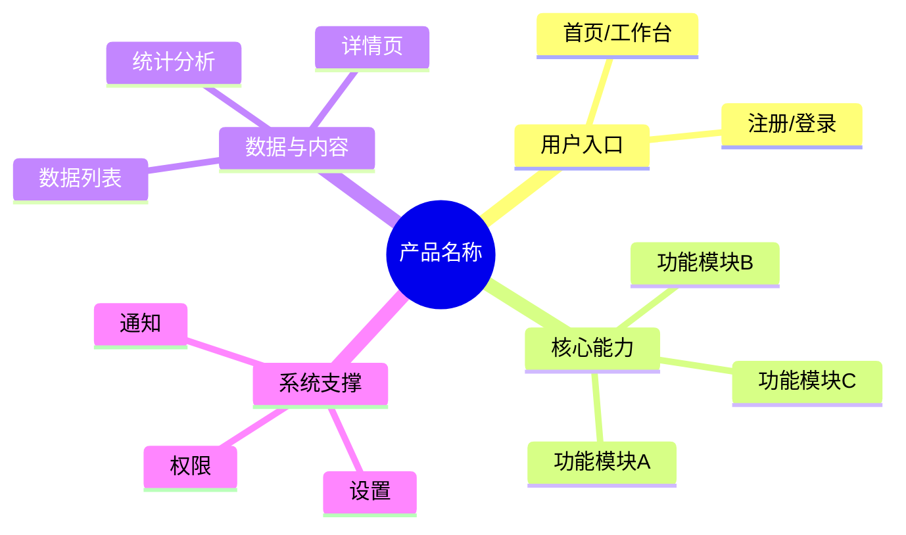
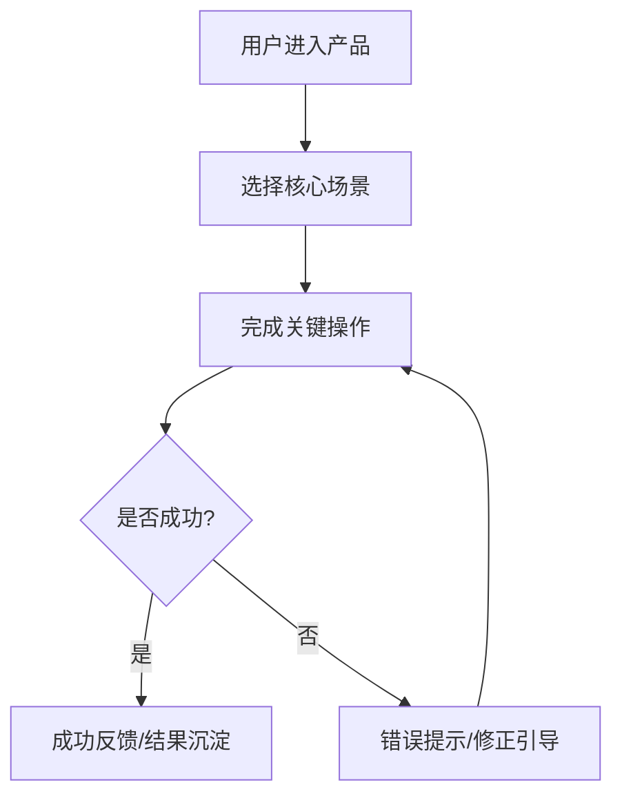

# 📝 PRD 文档工作流

## 🧠 AIky 集成

> 开始前，先阅读以下 AIky 知识：
> - `AIky/identity.md` — 统一身份档案；重点读取"有据可依"、"质量优先"、"细节控"、"用户价值导向"
> - `AIky/methodologies/priority-assessment/combination-guide.md` — 需求优先级标注使用融合评估法
>
> **PRD撰写要求**：
> - 每个需求标注优先级时，注明评估依据（核心场景/共性/频次/ROI）
> - 功能规则描述要具体，避免"可能""也许"
> - 异常处理要完整，体现全局观
> - 每个功能需附带验收标准（Acceptance Criteria）
> - 每条需求必须有稳定编号，作为后续任务、代码、测试的唯一追踪源
> - PRD 需包含产品框架图，明确模块边界和核心路径，作为架构设计输入

## 适用场景
- 新功能开发需求传递
- 产品迭代文档化
- 开发自查和交叉验收

## 执行步骤

### 1. 收集前序产出物
整合之前阶段的产出：
- 调研报告的需求清单和用户画像
- 竞品分析的差异化策略和借鉴点

### 2. 撰写 PRD
按照以下结构撰写完整 PRD：

```markdown
# [产品/功能名称] PRD

## 文档信息
| 信息项 | 内容 |
|-------|------|
| 文档版本 | v1.0 |
| 创建日期 | [日期] |
| 状态 | Draft / Frozen / Changed |
| 规格基线 | SPEC-v1.0 |

## 规格编号规范
| 类型 | 编号格式 | 说明 |
|------|----------|------|
| 用户需求 | REQ-001 | 用户目标、业务问题、核心场景 |
| 功能需求 | FR-001 | 可实现的功能行为 |
| 非功能需求 | NFR-001 | 性能、安全、兼容性、可用性 |
| 验收标准 | AC-001 | 可验证的验收条件 |
| 数据规格 | DATA-001 | 演示数据、边界数据、字段规则 |
| 风险约束 | RISK-001 | 假设、依赖、限制、风险 |

> 编号一旦进入 Frozen 状态不得复用。需求删除时标记 Deprecated，不直接移除编号。

## 一、产品概述
### 1.1 产品背景
### 1.2 产品目标
### 1.3 成功指标（北极星指标）
### 1.4 目标用户

## 二、用户需求清单
| 需求ID | 用户/角色 | 场景 | 问题/目标 | 价值 | 优先级 | 来源 |
|--------|-----------|------|-----------|------|--------|------|
| REQ-001 | [目标用户] | [使用场景] | [要解决的问题] | [用户/业务价值] | P0 | 调研/竞品/用户输入 |

## 三、产品框架图

> 产品框架图用于定义产品能力边界和核心路径，不替代后续架构设计。

### 3.1 产品模块结构


### 3.2 核心业务路径


### 3.3 模块与需求映射
| 产品模块 | 关联需求ID | 核心用户价值 | v1.0范围 |
|----------|------------|--------------|----------|
| 功能模块A | REQ-001 / FR-001 | [价值说明] | Included |

## 四、功能需求
### FR-001 [功能模块名称]
**来源需求**: REQ-001 / REQ-002
**优先级**: P0/P1/P2（标注评估依据）

**需求描述**: 简要描述

**用户故事**: 作为[角色]，我想要[操作]，以便[价值]

**功能规则**:
1. 规则1（具体、可测试）
2. 规则2

**交互说明**:
- 操作 → 反馈
- 状态流转说明

**验收标准（AC）**:
- [ ] AC-001: 具体可验证的条件
- [ ] AC-002: 具体可验证的条件

**异常处理**:
| 异常场景 | 触发条件 | 处理方式 | 用户提示 |
|---------|---------|---------|---------:|
| 场景1 | 条件 | 处理 | 提示文案 |

## 五、非功能需求
### NFR-001 性能要求
### NFR-002 安全要求
### NFR-003 兼容性

## 六、演示数据规格
### DATA-001 标准数据集
定义代码实现阶段需要的演示数据规格：
- 每个列表/表格的数据量要求（≥20条）
- 数据字段的真实性标准（中文名、合理数值）
- 需要覆盖的业务场景清单

### DATA-002 边界数据
- 空数据场景
- 极端值场景（最大/最小/超长文本）
- 特殊字符场景

## 七、版本规划
| 版本 | 功能范围 | 优先级 |
|------|---------|--------|
| v1.0 | 核心功能 | P0 |
| v1.1 | 增强功能 | P1 |
| v2.0 | 扩展功能 | P2 |

## 八、变更记录
| 日期 | 版本 | 变更内容 | 影响范围 | 处理状态 |
|------|------|---------|----------|----------|

## 九、SDD 追踪矩阵
| 需求ID | 验收标准ID | 架构模块 | 任务ID | 实现文件 | 测试用例ID | 状态 |
|--------|------------|----------|--------|----------|------------|------|
| FR-001 | AC-001, AC-002 | [模块名] | TASK-001 | 待实现 | TC-[模块]-001 | Draft |

## 十、规格冻结检查
- [ ] 所有 P0/P1 用户需求均有 REQ 编号
- [ ] 所有 P0/P1 功能需求均有 FR 编号
- [ ] 所有功能需求均有至少 1 条 AC
- [ ] 产品框架图已覆盖 v1.0 核心模块和核心业务路径
- [ ] 所有 AC 都是可执行、可观察、可判定的
- [ ] 非功能需求已编号并有可验证标准
- [ ] 演示数据规格已编号并覆盖正常/空态/异常/边界
- [ ] 追踪矩阵已初始化
- [ ] 用户确认后状态改为 Frozen
```

### 3. 输出 PRD 文档
在 `独立项目/[项目名]/3-PRD.md` 生成文档

## 产出物
- `3-PRD.md` - 产品需求文档

## 撰写原则
1. **明确性**: 避免模糊描述，使用具体数值和条件
2. **完整性**: 覆盖正常、异常、边界场景
3. **可验收**: 每个需求有明确的验收标准（AC）
4. **可追溯**: 每个需求有明确的来源和优先级依据
5. **数据驱动**: 定义演示数据规格，衔接代码实现阶段
6. **规格基线**: 代码实现前必须冻结 SPEC 版本，变更必须记录影响范围
7. **端到端追踪**: 每条 P0/P1 需求必须能追踪到任务、代码文件和测试用例
8. **框架先行**: 产品框架图先定义能力边界，再由架构阶段转为技术设计

## 下一步
PRD 撰写完成并冻结后，使用 `/pe-architecture` 进入架构设计阶段
