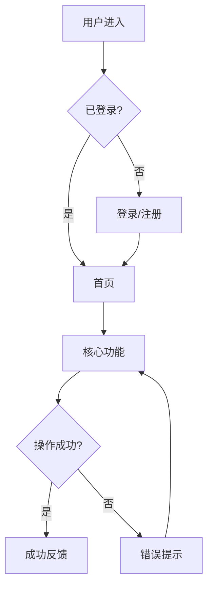

# 🏗️ 架构设计工作流

## 🧠 AIky 集成

> 开始前，先阅读以下 AIky 知识：
> - `AIky/identity.md` — 统一身份档案；重点读取"全局优先于局部"、"全局-细节双视角"、"三位一体"
> - `AIky/methodologies/priority-assessment/combination-guide.md` — 功能模块优先级排序使用融合评估法
>
> **架构设计要求**：
> - 必须基于 Frozen PRD 和产品框架图展开技术设计
> - 功能模块划分需映射到 `REQ/FR/AC`
> - 核心/增强/扩展模块的分类要用四象限+ROI交叉验证
> - 用户流程设计要回归真实使用场景

## 适用场景
- 新产品的整体架构规划
- 大型功能模块的设计
- 产品重构的架构梳理

## 执行步骤

### 1. 读取规格输入
读取 `3-PRD.md`，确认：
- PRD 状态为 `Frozen`
- 当前规格基线为 `SPEC-v*`
- 产品框架图已覆盖 v1.0 核心模块和核心业务路径
- P0/P1 `REQ/FR/AC/NFR/DATA` 已编号

如 PRD 未冻结或产品框架图缺失，先返回 `/pe-prd` 补齐。

### 2. 信息架构设计
基于 PRD 的产品框架图和功能需求，设计产品信息架构：

```
产品名称
├── 一级功能模块
│   ├── 二级功能
│   └── 二级功能
├── 一级功能模块
│   ├── 二级功能
│   └── 二级功能
└── 设置/个人中心
```

### 3. 功能模块划分
将产品功能划分为独立模块，并标注规格来源和优先级依据：

| 模块 | 层级 | 规格来源 | 优先级依据 | 版本规划 |
|------|------|----------|-----------|---------|
| 模块A | 核心 | FR-001 / AC-001 | 高频 + 高价值 + 全量用户 | v1.0 |
| 模块B | 增强 | FR-002 | 中频 + 体验提升 | v1.1 |
| 模块C | 扩展 | FR-003 | 低频 + 差异化 | v2.0 |

### 4. 用户角色与权限
定义不同用户角色及其权限矩阵：

| 角色 | 说明 | 核心权限 |
|------|------|---------|
| 普通用户 | 主要用户群 | 基础功能 CRUD |
| VIP用户 | 付费用户 | 高级功能 + 数据导出 |
| 管理员 | 运营管理 | 全部功能 + 数据管理 |

### 5. 核心用户流程
设计核心用户流程图（使用 Mermaid），要覆盖：
- **主流程（Happy Path）**: 核心任务闭环
- **分支流程**: 条件判断和分叉路径
- **异常流程**: 错误处理和回退路径



### 6. 数据模型设计
设计核心数据结构（使用表格描述）：

| 实体 | 字段 | 类型 | 说明 |
|------|------|------|------|
| User | id | UUID | 主键 |
| User | name | String | 用户名 |
| User | email | String | 邮箱，唯一 |

### 7. 技术选型
提供详细的技术实现方案，包含选型理由：

| 层级 | 技术方案 | 选型理由 |
|------|---------|---------|
| 前端 | HTML + CSS + JS / Vue3 | 轻量、即开即用 |
| 样式 | CSS Variables + Flexbox/Grid | 现代化、易维护 |
| 数据 | LocalStorage / IndexedDB | 前端独立、无需服务器 |
| 图标 | FontAwesome / Material Icons | CDN加载、覆盖全 |

### 8. API / 接口设计
如涉及前后端交互，设计核心 API：

| 方法 | 路径 | 说明 | 请求体 | 响应体 |
|------|------|------|--------|--------|
| GET | /api/items | 获取列表 | query params | `{data: [...]}` |
| POST | /api/items | 创建 | `{name, ...}` | `{id, ...}` |

> 注：纯前端项目此步可略过，但要设计好数据存储结构

### 9. 输出架构设计文档
在 `独立项目/[项目名]/4-架构设计.md` 生成文档，包含：

```markdown
# [项目名] 架构设计文档

## 一、规格基线
| 信息项 | 内容 |
|--------|------|
| PRD 文件 | `3-PRD.md` |
| SPEC 版本 | SPEC-v1.0 |
| PRD 状态 | Frozen |

## 二、产品框架承接
## 三、信息架构
## 四、功能模块说明
  ### 4.1 核心模块（v1.0）
  ### 4.2 增强模块（v1.1）
  ### 4.3 扩展模块（v2.0）
## 五、用户角色与权限
## 六、核心用户流程
## 七、数据模型设计
## 八、技术选型
## 九、API/接口设计
## 十、非功能性设计
  ### 10.1 性能目标
  ### 10.2 安全设计
  ### 10.3 可扩展性
```

## 产出物
- `4-架构设计.md` - 架构设计文档

## 下一步
架构设计完成后，使用 `/pe-tasks` 进入 SDD 任务拆解阶段
