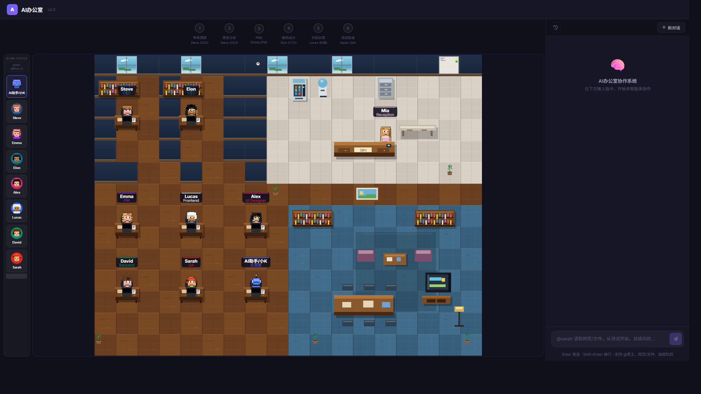

# AI办公室

AI办公室是一个本地运行的多智能体协作系统。它把产品、市场、技术、设计、前端、后端和测试等角色组织成一个可视化办公室，用户可以用自然语言发起任务，让不同“员工”协作完成调研、竞品分析、PRD、架构设计、页面原型、接口方案和测试用例等工作。



## 功能特点

- 多角色协作：内置 AI助手/小K、CEO、CTO、产品经理、UI 设计师、前端工程师、后端工程师和测试工程师。
- 阶段化工作流：支持调研、竞品、PRD、架构、开发、测试等流程，并可在关键节点审批继续。
- 可视化办公室：前端以像素办公室展示员工状态、任务进度和能力档案。
- 产出物管理：任务结果会保存为 Markdown 或 HTML，支持在页面内预览。
- 上下文读取：可读取用户指定的网页、文本文件或图片，辅助智能体完成任务。
- OpenAI 兼容接口：通过环境变量配置任意兼容 Chat Completions 格式的大模型服务。
- 内置 PE 工作流：仓库包含 `.agent/workflows/pe-workflows`，克隆后即可读取标准化产研流程提示词。

## 技术栈

- 后端：Python、FastAPI、WebSocket、aiohttp
- 前端：Vue 3、HTML、CSS、Canvas
- 配置：dotenv、JSON 能力注册表

## 快速开始

1. 安装 Python 3.8 或更高版本。
2. 安装依赖：

```bash
pip install -r requirements.txt
```

3. 复制环境变量模板：

```bash
copy .env.example .env
```

4. 在 `.env` 中填写自己的模型服务配置：

```env
LLM_API_KEY=your-api-key-here
LLM_BASE_URL=https://your-llm-provider.com/v1
LLM_MODEL=your-model-name
```

5. 启动服务：

```bash
start.bat
```

也可以手动启动：

```bash
cd backend
python -m uvicorn main:app --host 0.0.0.0 --port 8000 --reload --reload-dir .
```

启动后访问 `http://localhost:8000`。

## 配置说明

核心配置位于 `.env`：

- `LLM_API_KEY`：模型服务 API Key，不要提交到 GitHub。
- `LLM_BASE_URL`：OpenAI 兼容接口地址。
- `LLM_MODEL`：模型名称。
- `LLM_MAX_OUTPUT_TOKENS`：最大输出 token 数。
- `LLM_TIMEOUT_SECONDS`：请求超时时间。
- `SERVER_HOST` / `SERVER_PORT`：本地服务监听配置。

员工能力和工作流配置位于 `config/office_registry.json`。

PE 工作流文件位于 `.agent/workflows/pe-workflows`，后端默认从该目录读取。若需要使用外部工作流目录，可设置：

```env
AI_OFFICE_WORKFLOW_DIR=D:\path\to\pe-workflows
```

## 发布安全说明

本仓库不会提交真实模型 API、Key 或本地运行数据。以下内容已在 `.gitignore` 中排除：

- `.env`
- `history/`
- `workspace/`
- `inbox/`
- 日志、缓存、虚拟环境和编辑器本地配置

发布前请只提交 `.env.example`，并确认其中只包含占位值。

## 目录结构

```text
AI办公室/
├─ backend/                 # FastAPI 后端与智能体逻辑
├─ config/                  # 办公室员工和工作流注册表
├─ .agent/workflows/        # PE 工作流提示词与标准
├─ frontend/                # 静态前端页面与像素办公室
├─ .env.example             # 环境变量模板
├─ requirements.txt         # Python 依赖
└─ start.bat                # Windows 启动脚本
```

## 许可证

当前未指定许可证。公开发布前可根据需要补充 `LICENSE` 文件。
